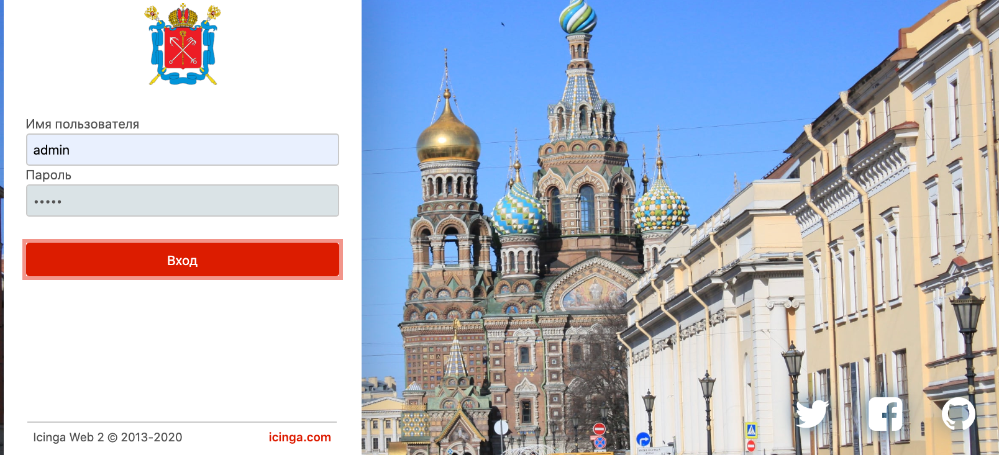
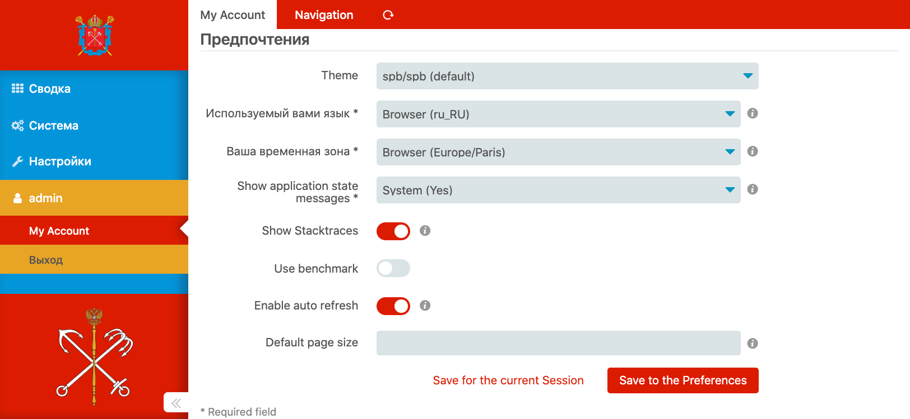
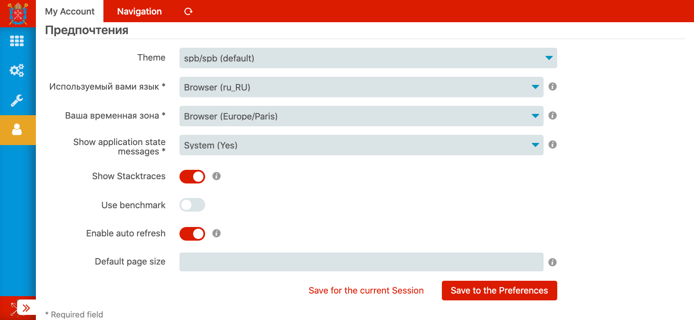
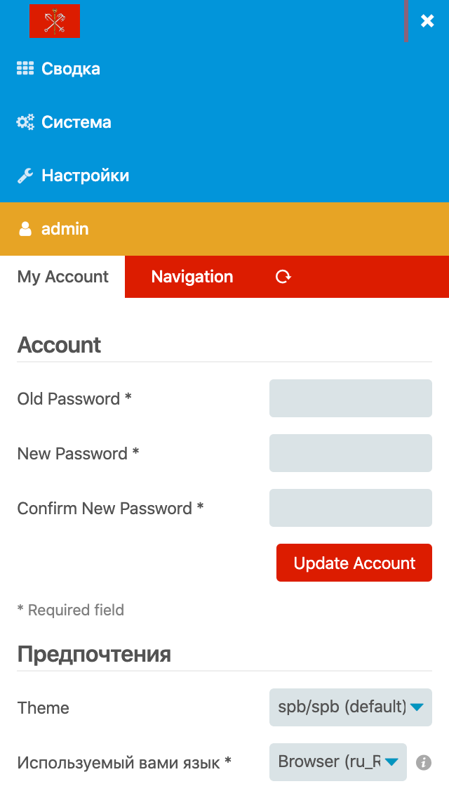

## [Saint Petersburg] theme for [Icinga Web 2]

Background photo: [Koichi IIJIMA] ([CC0])

### How to install

Save and enable as any other theme:

1. `git clone https://github.com/Al2Klimov/icingaweb2-theme-spb.git /usr/share/icingaweb2/modules/spb`
2. `icingacli module enable spb`
3. Navigate to the settings as needed and set the theme to "spb/spb":
    * Configuration / Application / Default Theme
    * My Account / Preferences / Theme

### Screenshots

[Saint Petersburg]: https://en.wikipedia.org/wiki/Saint_Petersburg
[Icinga Web 2]: https://github.com/Icinga/icingaweb2
[Koichi IIJIMA]: https://www.flickr.com/photos/mealisland/33508464525
[CC0]: https://creativecommons.org/publicdomain/zero/1.0/
